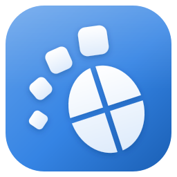

<p align="center"></p>

# WinGnome

**Make Windows 11 feel like GNOME (with a dash of macOS).**

WinGnome is a lightweight shell companion for Windows 11. It adds a GNOME-style top bar, a dock in the
style of Dash-to-Dock or macOS, round "traffic light" window buttons, an Activities overview, and a set of
reversible "streamline" tweaks. Everything is optional and configurable, and WinGnome puts the system back
the way it was when it exits.

> Status: early (v0.1). Built for Windows 11 23H2 and later. Windows 10 mostly works, but it isn't tested.

---

## Features

### Top bar
- **Logo menu**: a Windows logo at the far left opens a menu like the macOS Apple menu: About This PC, System Settings, WinGnome Settings, Microsoft Store, the Start menu, Task Manager, Sleep, Restart, Shut Down, Lock Screen, Log Out and Quit WinGnome. Restart, shut down and log out ask first. Use the arrow keys and Enter, or Esc to close.
- **Activities** button (or press **Alt+F1**, the Super key, or flick the pointer into the top-left hot corner) opens the overview.
- **Workspace dots** for Windows virtual desktops. Click a dot to switch desktops.
- **Focused app name** next to the dots, as in GNOME.
- **Centred clock**, formatted GNOME-style (`Wed 8 Oct  14:05`). Click it for a calendar.
- **System indicators**: network, volume (scroll on it to change the volume) and battery, drawn as GNOME-style symbolic icons.
- **Crisp at any scaling**: bold **Adwaita Sans** text (GNOME's own typeface, bundled; switch to Segoe UI in Settings → Top Bar → Font), with text, icons and tray icons sized to whole screen pixels at 100%, 125%, 150% and up.
- **Tray icons** (like macOS menu bar extras): the notification-area icons of your running apps (Discord, Steam, OneDrive, antivirus, ...) sit left of the system indicators, in the order they were added. Click, double-click, middle-click and right-click work as in the Windows tray, so app menus open right under the icon. Hover for the tooltip. Icons an app hides stay hidden. The Windows taskbar keeps its own copy of every icon, in both taskbar modes. Turn this off in Settings → Top Bar.
- **Quick settings** menu: volume and screen-brightness sliders (brightness for a laptop's built-in display; scroll or use the arrow keys on it too), Wi-Fi and Bluetooth shortcuts, screenshot, Settings, WinGnome settings, lock, and the power menu (sleep, restart, shut down, sign out). The chevrons on the sliders open the Sound and Displays panels, the battery row opens Power, and the calendar's *Date & time settings* opens Date & Time; Wi-Fi and Bluetooth open their Windows Settings pages. It also links to the hidden system tray and to Windows' own quick settings and notification centre.
- Registered as an AppBar, so maximised windows sit below the bar instead of under it. The bar hides automatically when a full-screen app runs.
- **Appearance**: you can set the background colour, text colour, opacity (0–100%), **blur or acrylic**, height, text size, the hover highlight's corner radius (square to pill), and a *floating* mode with a margin and rounded corners. The default is the classic solid black GNOME bar.

### Dock
- Pinned apps plus running apps, with **running-indicator dots** (one per window, up to four).
- **Click** focuses an app (restoring it if minimised), or minimises it if it's already focused. Other click actions: *cycle windows* or *show previews*.
- Running windows join their pinned icon, including Electron apps such as VS Code and Squirrel-installed apps such as GitHub Desktop and Discord.
- **Middle-click** opens a new window. **Right-click** lists the app's windows plus *New window*, *Pin/Unpin* and *Quit*.
- **Run as administrator** (right-click) starts an app elevated after the UAC prompt; pinned apps also get an *Always run as administrator* checkbox. As in Start, this works for desktop apps and full-trust Store apps such as Windows Terminal, but not for UWP apps such as Calculator or for File Explorer, which don't offer it. WinGnome itself never runs elevated.
- **Super+1…9** activates the n-th dock item.
- **Visibility modes**: *Always visible* (reserves screen space), *Intellihide* (hides only when a window overlaps it, the Ubuntu default) and *Autohide*.
- Optional macOS-style **hover magnification**, panel mode (stretch to the screen edges), a *Show Applications* button and a recycle bin.
- Bottom, left or right placement.
- **Appearance**: you can set the background colour (or follow the theme), opacity, **blur or acrylic** (the default), app icon size, icon spacing, distance from the screen edge, corner radius, magnification and the colour of the running-indicator dots. The settings pages show a live preview.
- Drag `.exe` or `.lnk` files onto the dock to pin them.

### Traffic-light window buttons
- Round **close, minimise and maximise** buttons drawn over normal windows' title bars.
- Colour **presets**: macOS, GNOME (Adwaita), Graphite, Pastel, or **Custom** with your own three colours.
- Left or right placement, macOS or Windows button order, adjustable size and spacing.
- Glyphs (× − +) appear on hover, and inactive windows can be dimmed, as on macOS.
- **Unified title bars**: optionally paints every decorated window's title bar in an Adwaita header colour so the round buttons blend in seamlessly. The original colours come back on exit.
- Per-app exclusions. Apps that draw their own title bars (Chrome, Edge, VS Code, Windows Terminal, WinUI 3 apps) are left alone automatically, unless you turn on *Decorate apps with custom title bars (experimental)*, which adds the circles to apps that report their buttons to Windows: Claude desktop, VS Code and Docker Desktop, for example. Under it, *Also decorate apps with web-drawn buttons* adds GitHub Desktop, whose buttons are part of its web page, from a built-in profile of their size, and Windows App SDK apps such as Dia that report only their maximise button. Before a click on such an app is passed on, WinGnome checks that the app still answers there as it did when its buttons were found (a strong check for apps that report their buttons, a weak one for web-drawn buttons).
- WinGnome's own settings window has a GNOME-style **header bar** with the same round buttons in your style (even with the overlay turned off). Hovering its maximise button shows Windows 11 Snap Layouts.
- Only one WinGnome instance per Windows session draws window buttons. A second instance (another `--settings-dir` profile) waits and takes over when the first one quits.

### Activities overview
- Full-screen overview with **live window thumbnails** (DWM). Click a thumbnail to focus that window, or hover and click × to close it.
  Thumbnails glide out of their windows when it opens and back when it closes (instant when Windows animations are off).
- **Type to search** apps and windows. Press Enter to launch the top hit and Esc to close.
- **Application grid** (from the dock's *Show Applications* button). Right-click an app to pin it to the dock or run it as administrator.
- **Ctrl+Shift+Enter** or **Ctrl+Shift+click** launches an app as administrator, as in Start.
- **Hot corner**: top-left, with a configurable delay.
- Optional: **Super key alone opens the overview** instead of the Start menu. Win+X, Win+E and other Win+key shortcuts keep working.

### Settings (a GNOME Settings app for Windows)
WinGnome's settings window works like GNOME Settings: a header bar, a **searchable sidebar** grouped like GNOME
(Ctrl+F jumps to the search box; Enter opens the best match), and the panel on the right.
- **Native panels** that change Windows itself, each read when you open it and released when you leave it:
  - **Displays**: arrangement (drag displays in the preview; they snap edge to edge), primary display, resolution and refresh rate. Changes are collected and applied together with *Apply*, then GNOME's **"Keep these display settings?"** countdown reverts them after 15 seconds unless you keep them. Scale is shown, and changed in Windows Settings.
  - **Sound**: output and input device, their volumes and mute, and per-app volume levels.
  - **Power**: battery state, power mode (Performance / Balanced / Power Saver), screen blank and automatic suspend (separately on battery and plugged in on laptops).
  - **Mouse & Touchpad**: primary button, pointer speed, mouse acceleration and scroll speed.
  - **Keyboard**: key repeat delay and speed (with a test field) and the installed input sources.
  - **Appearance**: Default (light) or Dark style, GNOME's accent colours (or automatic from the wallpaper), and the wallpaper (Windows' own pictures or your own).
  - **Multitasking**: hot corner, workspace indicator, Windows snapping (snap, snap layouts, snap suggestions) and whether Alt+Tab shows windows from all workspaces.
  - **Date & Time**: time zone (searchable) and the top bar clock's format.
  - **About**: device name, hardware model, memory, processor, graphics, disk capacity and Windows version.
- **Linked panels** open the matching Windows Settings page and are marked with an arrow: Wi-Fi, Network, Bluetooth, Printers, Removable Media, Colour (the colour management control panel), Notifications, Apps, Default Apps, Online Accounts, Sharing, Privacy & Security, Region & Language, Users, Accessibility and Windows Update.
- **WinGnome's own pages** (General, Top Bar, Dock, Window Buttons, Activities, Streamline, About WinGnome) sit in their own group at the bottom.
- In `--safe` mode the system panels are read-only. If Windows refuses a change (a policy, a missing API), the panel says so and offers the Windows Settings page.

### Streamline
- **Centre new windows** (GNOME behaviour).
- **Focus follows mouse** (X-Mouse style). This lasts for the session only and is restored on exit.
- **Taskbar mode** (Settings → General):
  - **WinGnome dock** (default): the Windows taskbar is hidden while WinGnome runs. Tray icons appear in the top bar. *Show system tray* in quick settings temporarily reveals the taskbar for Windows' own icons and the hidden-icons overflow.
  - **Native Windows taskbar**: the Windows taskbar stays, with its tray icons, Start button and jump lists, and the WinGnome dock is turned off. You can optionally set the taskbar to auto-hide and streamline it with the *Taskbar* tweaks: hide Search, Task View and Copilot, and centre the icons. These use only supported Windows settings, with no code injected into Explorer, so they keep working across Windows updates.
- Reversible **registry tweaks** (current user only, no admin needed). Each tweak backs up the original value and can be reverted one at a time or all at once:
  - Dark mode for apps and the system
  - **GNOME look** group: Adwaita blue accent colour (`#3584E4`, wallpaper-derived accent off), neutral title bars, Start and taskbar (no accent colour on them), an empty desktop (hide all icons) and no "Learn about this picture" Spotlight icon. Running apps are told about colour changes straight away; Start and the taskbar may need an Explorer restart, and the desktop tweaks always do
  - Classic (full) right-click context menu
  - No web results in Start search
  - No Start menu recommendations
  - No "suggestions", ads or auto-installed apps
  - Disable Aero Shake
  - Show file extensions
  - Disable the snap-layouts hover flyout
  - Open File Explorer to This PC

---

## Getting started

### Requirements
- Windows 11 (x64)
- [.NET 8 SDK](https://dotnet.microsoft.com/download/dotnet/8.0) 8.0.400 or a later 8.0 SDK to build (pinned in `global.json`), or the .NET 8 Desktop Runtime to run a build

### Build and run
```bash
dotnet build -c Release
```
```bash
dotnet run --project src/WinGnome -c Release
```

### Publish a single exe
Quit WinGnome first: a running copy locks `WinGnome.exe`, and the publish then leaves the old exe in place.
```bash
dotnet publish src/WinGnome -c Release -r win-x64 --self-contained false -p:PublishSingleFile=true -o publish
```
Then run `publish\WinGnome.exe` from Explorer. Settings live in `%APPDATA%\WinGnome`, so they carry over between
builds and updates. Turn on **Settings → General → Start with Windows** to launch it at sign-in.

### Opening settings
WinGnome has no tray icon. Open settings from the top bar's quick-settings menu (the system indicators at the
top right), or run `WinGnome.exe` again: a second launch opens the running instance's settings.

---

## Command line

| Switch | Effect |
|---|---|
| `--settings` | Open the settings window on start |
| `--settings-panel <id>` | Start WinGnome with the settings window open at a panel, e.g. `displays`, `sound`, `power`, `appearance` or `wingnome-dock` (ids in `PanelIds`). If WinGnome is already running with the same profile, it opens that panel there. |
| `--settings-dir <path>` | Use a separate profile folder (settings, tweak backups, log) |
| `--safe` | Safe mode: no taskbar hiding, no registry writes, no keyboard hooks (tray icons still show in the top bar; nothing to undo) |
| `--selftest` | Start every feature in safe mode, run for 5 s, exit with code 0 on success (used by CI and QA) |
| `--restore-taskbar` | Restore the Windows taskbar (after a crash, for example) and exit |

## Safety and recovery

WinGnome changes as little as possible, and it undoes everything it changes:

- **Taskbar**: the original auto-hide state is saved to `%APPDATA%\WinGnome\taskbar.state` *before* the taskbar is hidden. It is restored on exit, on crash, and on the next start if WinGnome was killed. As a last resort, run `WinGnome.exe --restore-taskbar`, or restart Explorer from Task Manager.
- **Title-bar colours and focus-follows-mouse** last for the session only. They are restored on exit or crash. If WinGnome is force-killed, they are restored on its next start, because WinGnome records what it changed before changing it.
- **Quitting**: use *Quit WinGnome* in quick settings or Settings → About. `taskkill /im WinGnome.exe` (without `/f`) also quits cleanly.
- **Registry tweaks** only touch `HKEY_CURRENT_USER`. The original values (including "value did not exist") are stored in `tweaks-backup.json`, and **Settings → Streamline → Revert all** restores them.
- **Tray icons**: WinGnome passes every tray-icon and AppBar message on to Explorer as it arrives, so Explorer always keeps all icons, even if WinGnome is killed. If Explorer ever fails to answer while WinGnome passes a message on, WinGnome asks apps to register their icons with Explorer again when it exits.
- **Display changes** from Settings → Displays are applied only after Windows accepts the new mode in a test, and the previous and new settings are saved to `display-revert.json` first. Until you choose *Keep Changes* the change is temporary (a reboot or sign-out drops it, as it is not written to the registry), and it reverts after 15 seconds, when you leave the panel or close the window during the countdown, and on the next start if WinGnome was killed during it.
- Other **Settings panels** change Windows settings on purpose (like Windows Settings does), so those changes are yours and stay after WinGnome exits. Nothing is changed in `--safe` mode.
- WinGnome never touches elevated (administrator) windows.
- Log file: `%APPDATA%\WinGnome\wingnome.log`.

## Known limitations

- Tray icons in the top bar come from apps that re-register their icons when asked (the Windows *TaskbarCreated* broadcast). Nearly all apps do, but an app whose icon belongs to a message-only window may only appear in the Windows tray. Windows' own system icons (network, volume, battery) are not tray icons in Windows 11; the top bar's system indicators replace them. Balloon notifications are left to Windows.
- WinGnome shows tray icons only when it runs without administrator rights, and only one WinGnome at a time hosts them. A second copy takes over when the first one exits. If another tray host is running (RetroBar, for example), WinGnome doesn't compete with it for icons.
- WinGnome doesn't restyle the native taskbar itself (rounded, floating or translucent). That would mean injecting code into Explorer, which breaks with Windows updates. If you want that, tools like Windhawk's *Taskbar Styler* can run alongside WinGnome in native taskbar mode.
- Apps that draw their own title bars keep their own buttons.
- The dock and top bar appear on the primary monitor only (multi-monitor support is on the roadmap).
- Workspace switching works by sending Ctrl+Win+←/→, because Windows has no public API for switching virtual desktops.
- If the Super-key option is on and an elevated window has focus, Windows opens Start instead. Windows blocks hooks from seeing keys sent to elevated windows.

## Recommendations and roadmap

Ideas for making Windows feel even more like GNOME, roughly in order of value:

1. **Multi-monitor**: a top bar and dock on every monitor, with per-monitor window lists.
2. **Workspace thumbnails** in the overview, plus drag-a-window-to-another-desktop.
3. **Super+arrow quarter tiling** and Super+drag to move or resize windows (GNOME and KDE muscle memory).
4. **Notification list** inside the calendar popup, as in GNOME's message tray.
5. **App folders** in the application grid, and drag-to-reorder in the dock.
6. **File search** in the overview (Windows Search via `search-ms:`).
7. **Wallpaper-aware accent colour** and an Adwaita accent palette for the top bar.
8. **Night Light and Do Not Disturb toggles** in quick settings.
9. An **MSIX package** and winget manifest for one-click install and auto-update.

Tips that pair well with WinGnome:
- Install the **Cantarell** or **Inter** font if you want the full GNOME typography. WinGnome uses Segoe UI Variable by default.
- Set a dark wallpaper and switch on the *Dark mode* tweak for the classic Adwaita-dark look.
- Use PowerToys **FancyZones** if you want more tiling than the built-in snap layouts.

---

## Architecture

```
src/WinGnome.Core          Pure logic (net8.0): settings, layout maths, filtering, search,
                           tweak bookkeeping, state machines. No Win32, fully unit-tested.
src/WinGnome               WPF app (net8.0-windows): interop, services and features.
  Infrastructure/          Settings service, logging, feature discovery, MVVM helpers
  Interop/                 P/Invoke (NativeMethods.*.cs), WinEvent hooks, AppBar, COM interfaces
  Services/                WindowTracker, TaskbarController, Apps (catalogue, icons, launcher)
  Features/                TopBar, Dock, Taskbar, WindowButtons, Overview, Behaviour, Settings
  Controls/TrafficLights/  Round window buttons shared by the overlay and the settings header bar
  Theme/                   Adwaita light and dark palettes and shared control styles
tests/WinGnome.Core.Tests  xUnit tests for Core
docs/PLAN.md               Engineering plan and conventions
docs/KNOWN_ISSUES.md       Known bugs, risks and limitations, by severity
assets/logo/               App logo (SVG source for all icon sizes; tools/Export-AppIcon.ps1 renders the .ico)
AGENTS.md                  How to work on WinGnome: planning, code, tests, QA, git
```

Each feature implements `IFeature` and is discovered automatically. Features never reference each other:
they talk through `ShellCommands`, so a crash in one feature can't take the others down.

### Running the tests
```bash
dotnet test
```

## Contributing

Issues and pull requests are welcome. Read [AGENTS.md](AGENTS.md) first. Please keep platform calls in `src/WinGnome` and logic in
`WinGnome.Core` with tests, and run `dotnet build -warnaserror` and `dotnet test` before submitting.

## Credits

- [Adwaita Sans](https://gitlab.gnome.org/GNOME/adwaita-fonts) by the GNOME project (based on Inter by Rasmus Andersson), bundled unmodified under the SIL Open Font License 1.1; see [assets/fonts/OFL.txt](assets/fonts/OFL.txt).
